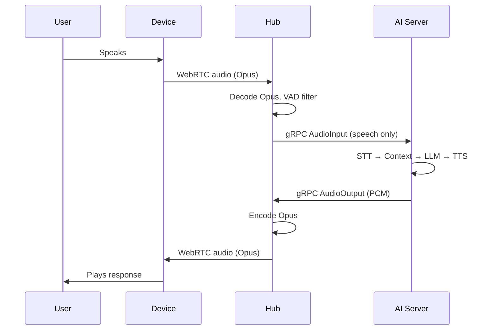

# NAILA Architecture

## Overview

NAILA is a local AI assistant with voice conversations, vision, and personality. The system runs on a local network with no cloud dependencies.

## System Architecture

```
┌─────────────────────────────────────────────────────────────────────────────┐
│                              DEVICE LAYER                                   │
│                                                                             │
│   ┌───────────────┐                                                         │
│   │  Raspberry Pi  │                                                        │
│   │  (Pi Audio)    │                                                        │
│   │  Mic, Speaker  │                                                        │
│   │  AEC           │                                                        │
│   └───────┬───────┘                                                         │
│           │                                                                 │
│        WebRTC                                                               │
│           │                                                                 │
└───────────┼─────────────────────────────────────────────────────────────────┘
            │
┌───────────▼───────────┐
│     Hub (Rust)         │
│  WebRTC ↔ gRPC relay   │
│  VAD, Opus codec       │
└───────────┬───────────┘
            │ gRPC
            │
┌───────────▼─────────────────────────────────────────────────────────────────┐
│                          AI SERVER (Python)                                  │
│                                                                             │
│   ┌─────────────────────────────────────────────────────────────────────┐   │
│   │                   LangGraph Orchestration                           │   │
│   │                                                                     │   │
│   │  process_input → process_vision → retrieve_context →                │   │
│   │  generate_response → execute_actions                                │   │
│   └──────────┬──────────────────────────────────────────────────────────┘   │
│              │                                                              │
│   ┌──────────▼──────────────────────────────────────────────────────────┐   │
│   │                      AI Services                                    │   │
│   │                                                                     │   │
│   │  ┌───────┐    ┌───────┐    ┌───────┐    ┌────────┐                  │   │
│   │  │  STT  │    │  LLM  │    │  TTS  │    │ Vision │                  │   │
│   │  │Whisper│    │Llama 3│    │ Piper │    │ YOLOv8 │                  │   │
│   │  └───────┘    └───────┘    └───────┘    └────────┘                  │   │
│   └─────────────────────────────────────────────────────────────────────┘   │
│              │                                                              │
│   ┌──────────▼──────────────────────────────────────────────────────────┐   │
│   │                      MQTT Layer                                     │   │
│   │  Device commands • Text responses • Audio responses • Alerts        │   │
│   └─────────────────────────────────────────────────────────────────────┘   │
│              │                                                              │
│   ┌──────────▼──────────────────────────────────────────────────────────┐   │
│   │                    Memory & Context                                  │   │
│   │              Conversation history per device                         │   │
│   └─────────────────────────────────────────────────────────────────────┘   │
└─────────────────────────────────────────────────────────────────────────────┘
```

## Components

### AI Server (`ai-server/`)

Python service that runs all AI models and orchestrates conversations.

**AI Services:**

| Service | Model | Purpose |
|---------|-------|---------|
| STT | faster-whisper (small.en) | Speech-to-text transcription |
| LLM | Llama 3 8B Instruct (llama-cpp-python) | Response generation |
| TTS | Piper (Lessac voice, ONNX) | Text-to-speech with SSML, emotion presets |
| Vision | YOLOv8 Nano (ultralytics) | Object detection, scene analysis |

**Orchestration (LangGraph):**

```
process_input → process_vision → retrieve_context → generate_response → execute_actions
```

- `InputProcessor` — validates and processes user input
- `ResponseGenerator` — generates natural language responses
- `NAILAOrchestrator` — wraps graph execution with MQTT integration
- Conversation memory tracked per `device_id`

**MQTT Communication:**
- Subscribes to device audio, sensor data, and system topics
- Publishes text responses, TTS audio, emotion data, and device commands
- See `MQTT_PROTOCOL.md` for full topic specification

**Key directories:**
- `services/` — AI model wrappers (STT, LLM, TTS, Vision)
- `graphs/` — LangGraph orchestration and state
- `agents/` — orchestrator, input processor, response generator
- `mqtt/` — MQTT client, handlers, routing
- `config/` — per-service configuration
- `memory/` — conversation history management

### Hub (`hub/`)

Rust service that bridges devices to the AI server via WebRTC + gRPC.

- Accepts WebRTC connections from Pi devices
- Decodes Opus audio, runs VAD to filter silence
- Forwards speech audio to AI server over gRPC (`StreamConversation`)
- Routes TTS audio back to the originating device
- HTTP signaling server on `:8080`, health endpoint on `/health`

See `STREAMING_ARCHITECTURE.md` for protocol details.

### Pi Audio Device (`devices/pi-audio/`)

Python WebRTC client for Raspberry Pi.

- Full-duplex audio via PortAudio
- SpeexDSP echo cancellation
- aiortc WebRTC connection to hub (Opus, 48kHz, 20ms frames)
- Automatic reconnect with exponential backoff
- Health endpoint on `:8081/health`

## Technology Stack

| Layer | Technology |
|-------|-----------|
| AI Orchestration | LangGraph |
| LLM | Llama 3 8B via llama-cpp-python |
| STT | faster-whisper |
| TTS | Piper (ONNX) with SSML + emotion presets |
| Vision | YOLOv8 via ultralytics |
| Streaming | WebRTC (webrtc-rs / aiortc) + gRPC (tonic / grpcio) |
| Messaging | MQTT (paho-mqtt / Mosquitto broker) |
| Hub | Rust, Tokio, Axum |
| Hardware Detection | Auto CPU/CUDA/MPS selection |

## Communication Paths

```
Pi Audio ─────── WebRTC ──► Hub ──── gRPC ─► AI Server
AI Server ────── MQTT ────────────────────► All Devices
```

## Data Flow: Voice Conversation



## Related Docs

- `STREAMING_ARCHITECTURE.md` — WebRTC/gRPC streaming protocol details
- `MQTT_PROTOCOL.md` — MQTT topic hierarchy and message formats
- `FLOW.md` — Multi-agent interaction flow
- `SETUP.md` — Installation and setup guide
